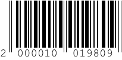

# 4d-component-barcode
Generate 1D barcode using pure 4D code

代表的なバーコードを作成するメソッドです。

対応バーコードタイプ

* EAN8
* EAN13
* UPC-A
* UPC-E
* Code39

**注記**: JANはEANと同じです。

```
$amount:=1980

  //TERAOKA自動セルフレジ仕様
$code:="200001"+String(Abs($amount);"000000")

  //JANコード（SVGピクチャ）を作成
$bar:=Barcode_create ($code;"EAN13")

$path:=Temporary folder+$code+".png"
WRITE PICTURE FILE($path;$bar)

OPEN URL($path;"Preview")
```


